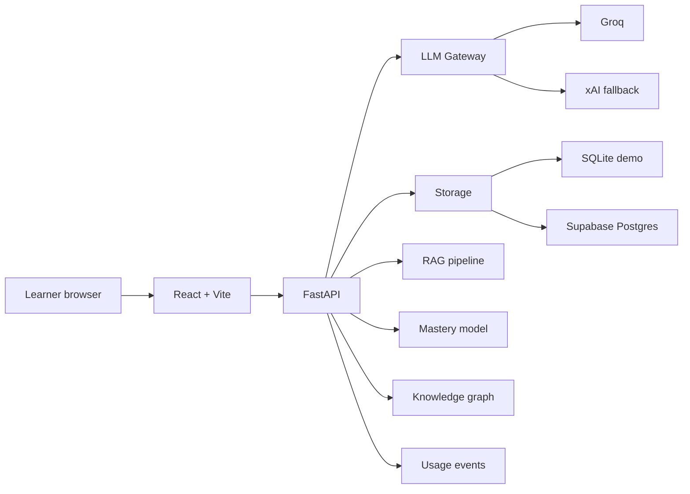
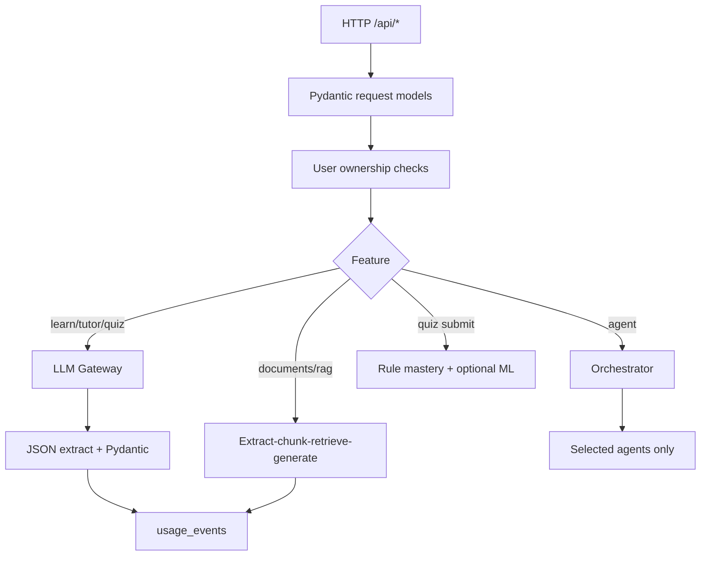
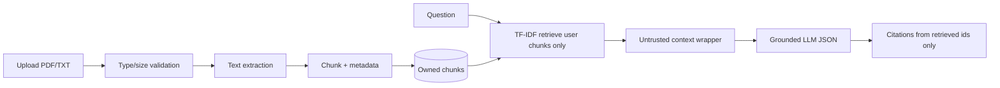
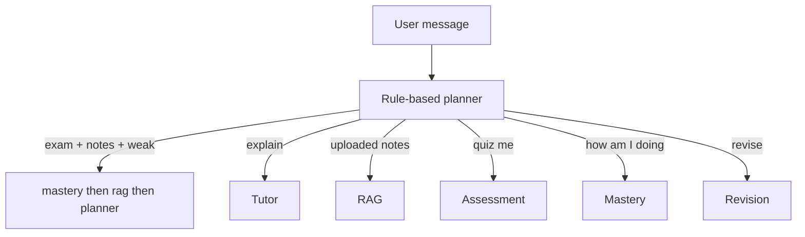

# LearnWise AI Architecture

LearnWise AI is an adaptive learning platform: generative lessons, diagnostic assessment, mastery tracking, document RAG, a routed agent layer, and LLMOps/MLOps foundations.

## System context

## Request path

## RAG pipeline

Document text is untrusted. The system prompt forbids following instructions found inside SOURCE blocks. Citations cannot be invented: `used_source_ids` are intersected with retrieved chunk ids.

## Agentic routing

The orchestrator does not call every agent on every request. Mixed goals compose a short tool list in order.

## Mastery

Two layers:

1. **Rule baseline** (preserved): `score = clamp(accuracy*100 + recency ±5 + streak*3, 0, 100)`.
2. **ML layer**: logistic regression on synthetic bootstrap features (`accuracy`, attempts, recency, streak, difficulty, time gap, rule score). Metrics are stored with an explicit synthetic disclaimer.

The knowledge graph supplies prerequisite gaps (e.g. weak Logistic Regression → Probability / Gradient Descent).

## LLM gateway

All model calls go through `backend/llm/gateway.py`:

- Provider auto-select (Groq, then xAI)
- Task routing (`simple`, `structured`, `complex`, `rag`)
- Timeouts and retries
- Structured output parse + Pydantic
- Prompt name + version
- Token / latency / success events (no raw prompts, no document text)

## Storage

| Mode | When | Backend |
|------|------|---------|
| Local/demo | `SUPABASE_URL` unset | SQLite in `data/learnwise.db` |
| Production | Supabase env set | Postgres via Supabase client + `database/schema.sql` |

Every query is scoped by `user_email`. One learner cannot read another learner's sessions, documents, chunks, or events.
